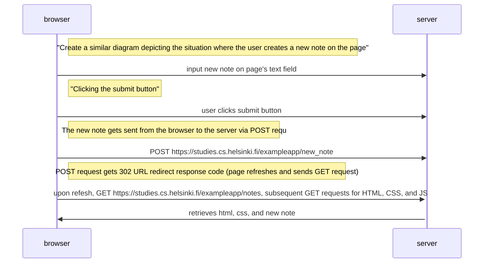

```mermaid

sequenceDiagram

    participant browser
    participant server


Note right of browser: "Create a similar diagram depicting the situation where the user creates a new note on the page"

browser->>server: input new note on page's text field

Note right of browser: "Clicking the submit button"

browser->>server: user clicks submit button

Note right of browser: The new note gets sent from the browser to the server via POST requ

browser->>server: POST https://studies.cs.helsinki.fi/exampleapp/new_note
activate server

Note right of browser: POST request gets 302 URL redirect response code (page refreshes and sends GET request)

browser->>server: upon refesh, GET https://studies.cs.helsinki.fi/exampleapp/notes, subsequent GET requests for HTML, CSS, and JS

server->>browser: retrieves html, css, and new note 
```