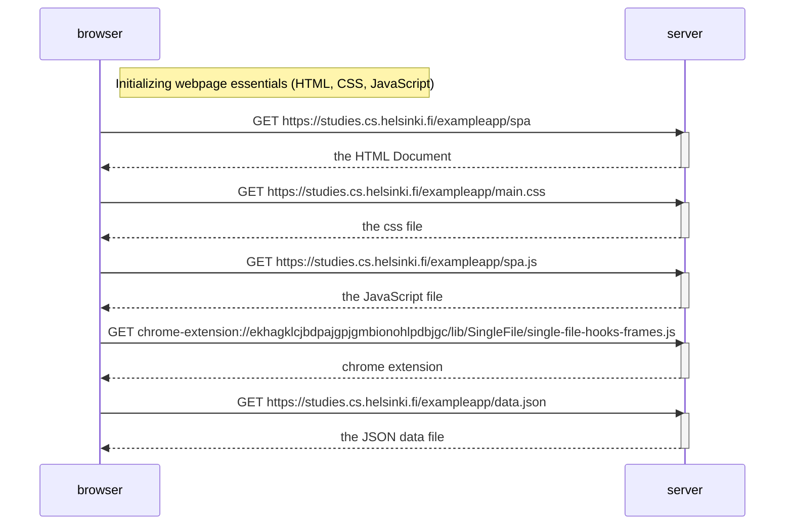

```mermaid

sequenceDiagram

    participant browser
    participant server

Note right of browser: Initializing webpage essentials (HTML, CSS, JavaScript)

browser->>server: GET https://studies.cs.helsinki.fi/exampleapp/spa
activate server
server-->>browser: the HTML Document
deactivate server

browser->>server: GET https://studies.cs.helsinki.fi/exampleapp/main.css
activate server
server-->>browser: the css file
deactivate server

browser->>server: GET https://studies.cs.helsinki.fi/exampleapp/spa.js
activate server
server-->>browser: the JavaScript file
deactivate server

browser->>server: GET chrome-extension://ekhagklcjbdpajgpjgmbionohlpdbjgc/lib/SingleFile/single-file-hooks-frames.js
activate server
server-->>browser: chrome extension
deactivate server

browser->>server: GET https://studies.cs.helsinki.fi/exampleapp/data.json
activate server
server-->>browser: the JSON data file
deactivate server

```