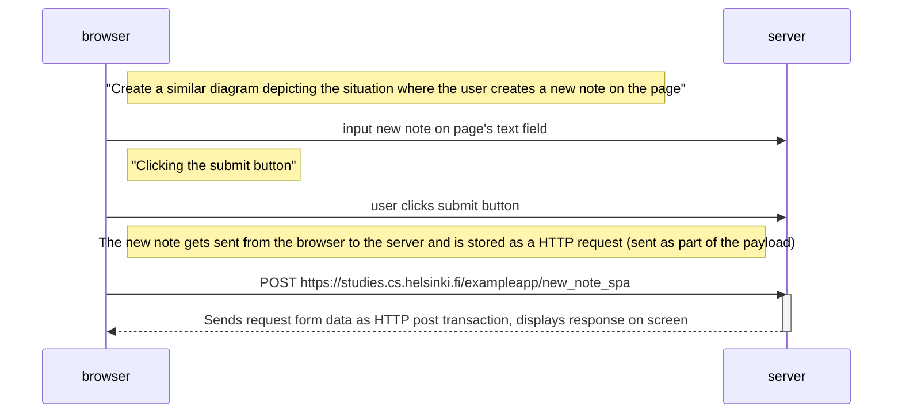

```mermaid

sequenceDiagram

    participant browser
    participant server

Note right of browser: "Create a similar diagram depicting the situation where the user creates a new note on the page"

browser->>server: input new note on page's text field

Note right of browser: "Clicking the submit button"

browser->>server: user clicks submit button

Note right of browser: The new note gets sent from the browser to the server and is stored as a HTTP request (sent as part of the payload)

browser->>server: POST https://studies.cs.helsinki.fi/exampleapp/new_note_spa
activate server
server-->>browser: Sends request form data as HTTP post transaction, displays response on screen
deactivate server
```